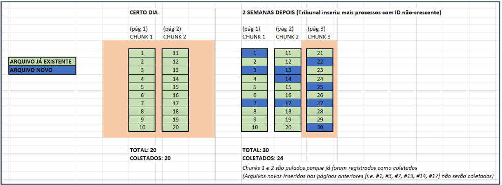

# Inspira Crawlers

## Sobre
Os crawlers são utilizados para coletar os processos dos tribunais.
Há um crawler para cada tribunal.

Geralmente há dois arquivos associados a um dado processo, um contendo os metadados e outro o inteiro teor. Às vezes há apenas um arquivo (e.g. alguns do SCRFB), às vezes há mais de dois (e.g. TJRJ), a depender do tribunal e do processo específico.

Estes arquivos podem vir em formato JSON, PDF, DOC, HTML ou RTF.

Alguns detalhes sobre cada tribunal podem ser encontrados em: https://docs.google.com/spreadsheets/d/1-J6Ll5PYYfwXSCybjXZi-oxL8LlrhTzVCKMWDMKaLUM/edit#gid=177139189

Há algumas questões que variam conforme cada tribunal:
- Como é feita a paginação?
- Como coletar a contagem de processos existentes? (e.g. não existe para o TIT-SP)
- Como navegar na página para obter tanto os metadados quanto os inteiros teores?
- Qual query devolve a totalidade dos processos existentes?
- O tribunal insere processos em datas antigas?
- O site permite a busca apenas por data ou requer parâmetros adicinoais?
- Qual o limite de resultados exibidos para uma dada query? É preciso fatiar em queries mais específicas para coletar todos os processos? (e.g. TRF4 limita a 1000 resultados por busca, número insuficiente para todos os processos de dias mais movimentados)
- Como separar a coleta em períodos menores?
- Podemos separar a coleta por data de publicação? Data de julgamento? Essas informações são sempre disponíveis para um processo ou só alguns?
- Como fazer as queries?
- As contagens de processos existentes são confiáveis? (e.g. TJPR às vezes exibe a contagem ignorando os filtros)
- Como o site lida com erros? São frequentes? São resolvidos por retentativas? (e.g. www.shorturl.at/jlsHJ )
- Todo processo tem um par de metadado/inteiro teor?
- O tribunal mudou o formato e a disponibilidade dos arquivos conforme o tempo? (e.g. processos antigos do TRF5 são em PDF e recentes são em HTML)
- Há documentos vazios ou inválidos? Retentativas de download resolvem isso?
- Com que frequência o site fica fora do ar e como ele demonstra isso? (Resposta 500? Resposta 200 com mensagem de erro? Fornecimento de metadados e de inteiros teores quebram simultaneamente ou apenas um?)
- Existem captchas?
- Há restrições de IP ou de sessão? É possível coletar qualquer dado apenas com o link correspondente?
- Precisamos de um automatizador de browser como o Selenium (o que utilizamos atualmente) ou o Playwright?
- Existe alguma API de onde podemos coletar os dados diretamente sem navegar pelo site?

#### Estrutura dos Crawlers
    (WIP)

#### Rastreio de progresso
O rastreio de quais páginas já foram coletadas depende dos arquivos contidos nas pastas `.state` e `.snapshot`, geradas e preenchidas no decorrer da coleta.

`.state` contém os arquivos que representam uma fração da coleta, os `chunks`. Tipicamente um `chunk` representa uma página.

`.snapshot` contém os arquivos que representam uma coleta inteira e são gerados após o término da coleta.

Ao coletar um `chunk` (página), o crawler verifica se já existe um `chunk` com os mesmos parâmetros em `.state`. Se houver, a coleta daquela página é dada como ok e pulada.

Exemplo de instanciação de um chunk para o TRF3:
~~~
TRF3Chunk(
                keys={**self.filters, **{'page': page}},
                prefix='',
                page=page,
                total=total,
                filters=self.filters,
                client=self.client,
            )
~~~

Um cuidado deve ser tomado para tribunais que inserem processos em datas antigas. Numa data futura, o crawler pode dar como já coletada uma data antiga na qual posteriormente foi inserido um novo processo, conforme o diagrama:

Isso pode ser contornado refazendo a coleta do zero.

No futuro idealmente teríamos o controle arquivo a arquivo de quais temos nos nossos buckets e quais não.

#### Montando um crawler
    (WIP)
Para montar um novo crawler, há três passos principais:

#### Lidando com Captchas

Alguns tribunais utilizam captchas para restringir o acesso aos processos. Atualmente utilizamos duas estratégias para lidar com isso, a depender da possibilidade:
- Download do arquivo de áudio associado ao captcha e reconhecimento automático deste (e.g. TJMG)
- Uso de APIs de resolução manual de Captchas, hoje utilizamos o `www.humancoder.com` - pode ser usado tanto para captchas de reconhecimento de texto quanto para o reCaptcha, de clicar. (e.g. TRF1 e TRF5)

A primeira opção é preferível quando for possível, pois é grátis e não requer serviços de terceiros. Ocasionalmente o serviço de captcha que utilizamos atualmente (2022-11-01) fica fora de ar.

## Setup

Para gestão de dependências usamos o poetry (https://python-poetry.org/). Uso é simples e a doc é boa, seguir instalação por lá conforme esta seu ambiente. Alguns comandos úteis:

    $ poetry shell   # abre um shell com virtualenv configurado
    $ poetry install  # instala as deps
    $ poetry add pydantic

E assim por diante.

## Dependências

Além das listadas no `pyproject.toml`, para o celery precisaremos do `redis` instalado localmente.

### Virtualenv

Para ativar o virtualenv com as deps instaladas, use o poetry. Recomendado.

    $ poetry shell
    (.venv) $

A partir desse ponto você tem um ambiente python com as deps instaladas e isoladas, sem conflitos com outros projetos.

## Docker

WIP

## Rodando

### Env vars

Antes, configure seu `.env`. Há um `.env.dist` que serve de exemplo.

### Comandos

Localmente, via poetry shell e python direto. No caso se seu crawler faz uso do celery, primeiro precisa subir os workers. Há uma dependência pelo redis que funciona com o broker e backend para o celery. Via docker-compose não há necessidade do redis instalado local pois lá já sobe um.

    $ celery -A tasks worker -Q crawlers --concurrency=2 -E --loglevel=INFO

Ajuste o loglevel conforme preferir.

Em outro shell é possível disparar uma task via command line. Exemplo:

    $ python commands.py tjba --start-date 2020-05-01 --end-date 2020-05-30 --output-uri ./data/tjba

Esta é a lista de parâmetros disponíveis para cada tribunal.
Idealmente no futuro todos os crawlers devem ter os mesmos parâmetros. A implementação de alguns parâmetros secundários (e.g. skip-cache) precism de revisão.
|  | *start-date* | *end-date* | *start-year* | *end-year* | *output-uri* | *pdf-async* | *skip-pdf* | *skip-cache* | *enqueue* |  *split-tasks* | *browser* | *count-only* |
| :---: | :---: | :---: | :---: | :---: | :---: | :---: | :---: | :---: | :---: | :---: | :---: | :---: |
| **CARF** | :avocado: | :avocado: |  |  | :avocado: |  |  |  |  :avocado: |  :avocado: |  |  |
| **SCRFB** | :avocado: | :avocado: |  |  | :avocado: |  |  | | :avocado:  |  :avocado: |  | :avocado: |
| **STF** | :avocado: | :avocado: |  |  | :avocado: | :avocado: | :avocado: |  |  :avocado: |  :avocado: |  |  |
| **STJ** | :avocado: | :avocado: |  |  | :avocado: |  |  |  |  :avocado: |  :avocado: |  |  |
| **TITSP** | :avocado: | :avocado: |  |  | :avocado: |  |  |  |  :avocado: |  :avocado: |  |  |
| **TJBA** | :avocado: | :avocado: |  |  | :avocado: |  |  |  |  :avocado: |  :avocado: |  |  |
| **TJMG** | :avocado: | :avocado: |  |  | :avocado: |  |  |  |  :avocado: |  :avocado: |  |  |
| **TJPR** | :avocado: | :avocado: |  |  | :avocado: |  |  | | :avocado:  |  :avocado: |  | :avocado: |
| **TJRJ** | |  | :avocado: | :avocado: | :avocado: | :avocado: | :avocado: |  |  :avocado: |  :avocado: |  |  |
| **TJRS** | :avocado: | :avocado: |  |  | :avocado: |  |  |  |  :avocado: |  :avocado: |  |  |
| **TJSP** | :avocado: | :avocado: |  |  | :avocado: | :avocado: | :avocado: | :avocado: | :avocado: | :avocado: | :avocado: |  |
| **TRF1** | :avocado: | :avocado: |  |  | :avocado: |  |  |  |  :avocado: |  :avocado: |  |  |
| **TRF2** | :avocado: | :avocado: |  |  | :avocado: | :avocado: | :avocado: |  |  :avocado: |  :avocado: |  |  |
| **TRF3** | :avocado: | :avocado: |  |  | :avocado: |  |  |  |  :avocado: |  :avocado: |  |  |
| **TRF4** | :avocado: | :avocado: |  |  | :avocado: |  |  |  |  :avocado: |  :avocado: |  |  |
| **TRF5** | :avocado: | :avocado: |  |  | :avocado: |  |  |  |  :avocado: |  :avocado: |  |  |
| **TST** | :avocado: | :avocado: |  |  | :avocado: |  |  |  |  :avocado: |  :avocado: |  |  |

 

### Parâmetros:
 

 
 &emsp;**start-date:**  &emsp;Data **inicial** da coleta dos processos, pode ser de julgamento ou de publicação, dependendo do tribunal (e.g. 2022-12-31).

 &emsp;**end-date:**  &emsp;Data **final** da coleta dos processos, pode ser de julgamento ou de publicação, dependendo do tribunal (e.g. 2022-12-31).

 &emsp;**start-year:**  &emsp;Ano **inicial** da coleta dos processos, pode ser de julgamento ou de publicação, dependendo do tribunal (e.g. 2019).

 &emsp;**end-year:**  &emsp;Ano **final** da coleta dos processos, pode ser de julgamento ou de publicação, dependendo do tribunal (e.g. 2019).

 &emsp;**output-uri:**  &emsp;Diretório onde as pastas (com caminho /{ano}/{mês}/{arquivo} )com os arquivos serão salvos (e.g. gs://inspira-carf ou ./data/trf3 )

 &emsp;**pdf-async:** &emsp; Baixa os PDFs asincronamente (flag)

 &emsp;**skip-pdf:**  &emsp;Ignora a coleta dos pdfs (flag)

 &emsp;**skip-cache:**  &emsp;Ignora os arquivos de progresso e inicia a coleta do zero (flag)

 &emsp;**enqueue:**  &emsp;Torna a coleta em uma task do celery (flag)

 &emsp;**browser:** &emsp; Mostra o browser no processo de coleta (flag)

 &emsp;**split-tasks:**  &emsp;Para ser usado junto ao *enqueue*, divide as tasks em sub-períodos (e.g. --split-tasks months)

 &emsp;**count-only:**  &emsp;Crawler irá apenas coletar as contagens de processos do dado período (flag)

  
 

 
  
&emsp;Para o TJSP, TRF5 e TRF1 é possível coletar apenas os inteiros teores dos metadados correspondentes que não tenham um inteiro teor associado ainda, definindo um ano e mês específico com o parâmetro "prefix":

    $ python commands.py tjsp-pdf --input-uri gs://inspira-production-buckets-tjsp --prefix 2022/04 
 

## Produção

WIP
